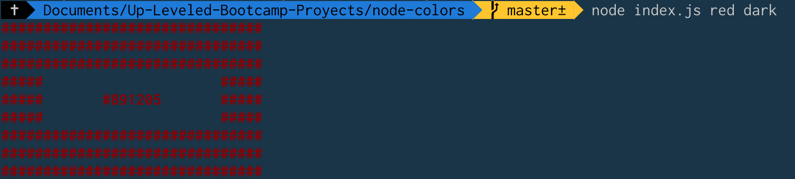
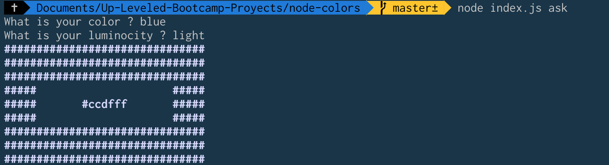
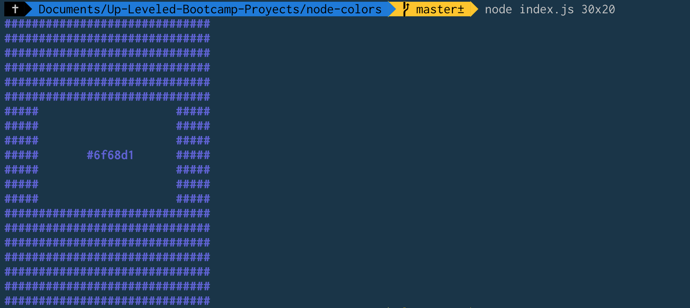

# Node colors

this small app is an exercise that allow the user create a square from the selected color

## Usage

run index.js give you a response whit a random color

if you want to use your own colors just type the color and the luminosity as arguments

```sh
node index.js red dark
```



you can also type

```sh
node index.js ask
```



to get a more interactive response

Also, you can change the size of the square using as first argument a WWxHH number

```sh
node index.js 30x20
```


